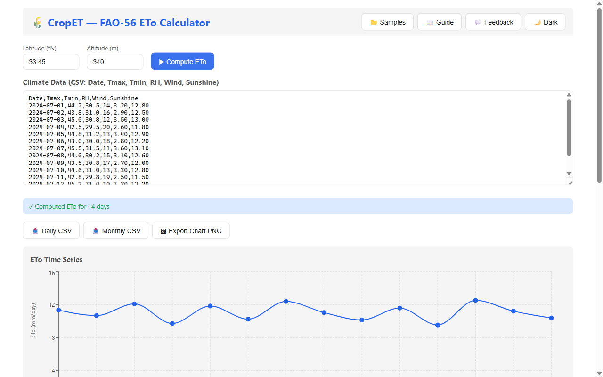

# CropET

**Modern web-based reference evapotranspiration (ETo) calculator — replacing CROPWAT for the 21st century.**



---

## What It Does

CropET computes daily reference evapotranspiration (ETo) using the **FAO-56 Penman-Monteith** equation — the international standard method published by the UN Food and Agriculture Organization. Input your climate data (temperature, humidity, wind, sunshine), and CropET returns a time-series of ETo values with interactive charts and CSV export.

It replaces the legacy CROPWAT desktop tool (1990s-era, crashes on modern Windows) with a clean, browser-based experience backed by a fully tested TypeScript engine.

## Features

- 📊 **Daily ETo computation** — FAO-56 Penman-Monteith, validated against FAO-56 worked examples (Examples 1–18)
- ☀️ **Solar radiation estimation** — extraterrestrial radiation, sunshine-based Rs, net shortwave/longwave
- 💧 **Psychrometric calculations** — saturation & actual vapor pressure, slope of VP curve, psychrometric constant
- 📈 **Interactive ETo chart** — daily time-series visualization with Recharts
- 📁 **CSV import/export** — paste or upload climate data, export daily & monthly ETo tables
- 🌡️ **Unit conversion** — °F↔°C, mph↔m/s built in
- 🧪 **Thoroughly tested** — Vitest suite validated against FAO-56 Paper 56 reference values

## Quick Start

```bash
# Prerequisites: Node.js ≥ 18, pnpm
pnpm install
pnpm build

# Run the web app
cd packages/web
pnpm dev
# → http://localhost:1450

# Run engine tests
cd packages/engine
pnpm test
```

## Key Equations

### FAO-56 Penman-Monteith (reference ETo)

```
ETo = [0.408 Δ (Rn − G) + γ (900 / (T + 273)) u₂ (eₛ − eₐ)]
      ÷ [Δ + γ (1 + 0.34 u₂)]
```

| Symbol | Meaning |
|--------|---------|
| Δ | Slope of saturation vapor pressure curve (kPa/°C) |
| Rn | Net radiation (MJ/m²/day) |
| G | Soil heat flux (≈ 0 for daily steps) |
| γ | Psychrometric constant (kPa/°C) |
| T | Mean daily air temperature (°C) |
| u₂ | Wind speed at 2 m height (m/s) |
| eₛ | Saturation vapor pressure (kPa) |
| eₐ | Actual vapor pressure (kPa) |

### Saturation Vapor Pressure

```
e°(T) = 0.6108 × exp(17.27 T / (T + 237.3))
```

## Tech Stack

| Layer | Technology |
|-------|------------|
| Engine | TypeScript, Vitest |
| Web | React 19, Vite, Recharts, PapaParse |
| Monorepo | pnpm workspaces |

## Project Structure

```
cropet/
├── packages/
│   ├── engine/          # @cropet/engine — pure computation
│   │   └── src/
│   │       ├── climate.ts        # Climate data parsing & unit conversion
│   │       ├── radiation.ts      # Solar/net radiation (Ra, Rs, Rn)
│   │       ├── psychrometric.ts  # Vapor pressure, Δ, γ
│   │       ├── eto.ts            # FAO-56 PM ETo equation
│   │       ├── export.ts         # CSV export, monthly aggregation
│   │       └── index.ts          # Public API
│   └── web/             # @cropet/web — browser UI
│       └── src/
│           ├── App.tsx           # Climate data entry form
│           ├── EToChart.tsx      # ETo time-series chart
│           └── main.tsx          # React entry point
├── PLAN.md
├── pnpm-workspace.yaml
└── package.json
```

## License

MIT
